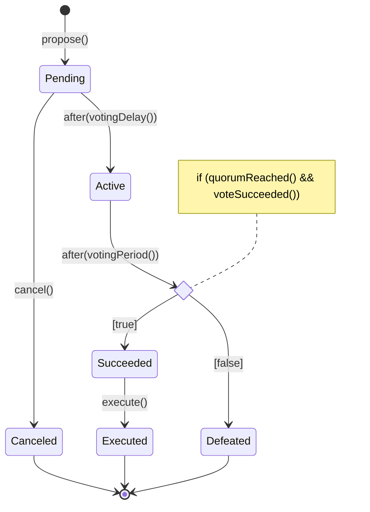
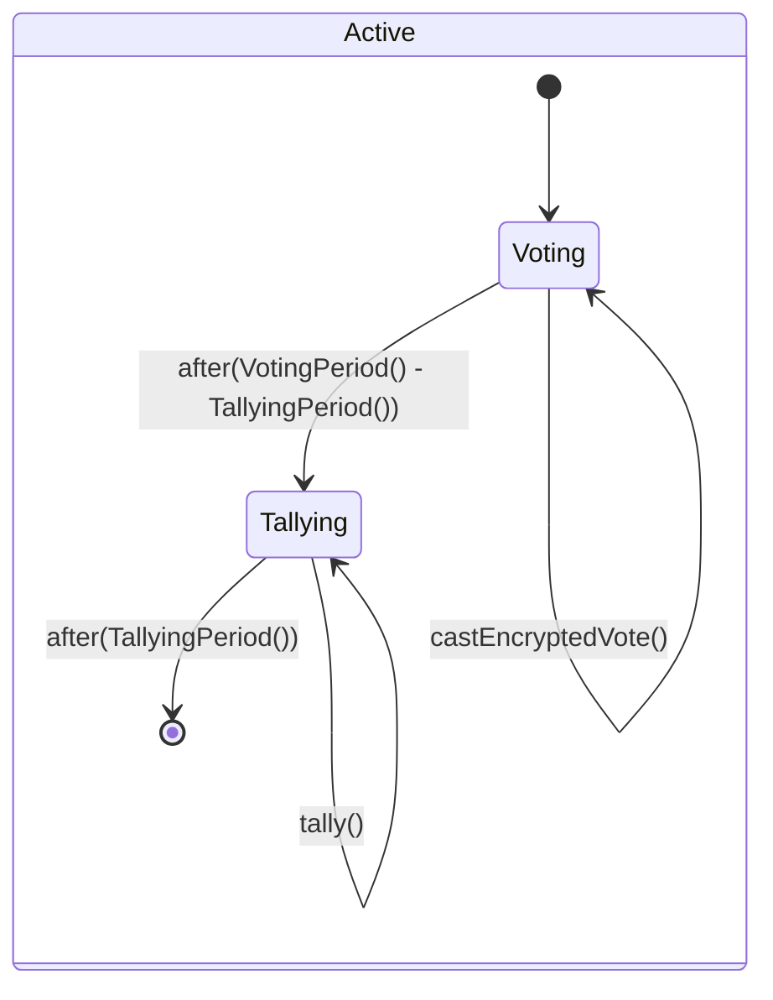

The following diagram shows the lifecycle of a proposal in the usual OpenZeppelin Governance framework.

In the `GovernorEncrypted` module, we further split the `Active` state into two sub-states:
- a `Voting` phase, in which voters can cast encrypted votes by invoking the method `castEncryptedVote()`
- a `Tallying` phase, in which tallying authority can decrypt off-chain the voting result and post it on-chain by invoking the method `tally()`

`GovernorEncrypted` is an abstract contract. In order to use it, the following two methods need to be implemented:
- `tallyingPeriod() public view virtual returns (uint256)`, which defines the length of the tallying period. The module `GovernorEncryptedSettings` allow to set this parameter at contract deployment, and, possibly, later update it via a governance proposal.
- `_getCurrentPk() internal virtual returns (GroupElement storage)`, which returns the current voting public key. The module `UpdateablePublicKey` allows the deployer to initialize the public key after the contract is deployed. Successive updates of the public key require a governance proposal.
